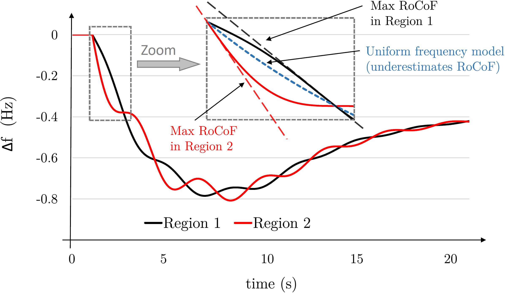

# TwoRegion_Frequency
Deduce frequency-stability constraints for a two-region power system. 

----

If you use this code for your own work, please cite these papers:
 <ol>
  <li>  L. Badesa, F. Teng, and G. Strbac, "<b>Simultaneous Scheduling of Multiple Frequency Services in Stochastic Unit Commitment</b>," [arXiv preprint](
https://arxiv.org/abs/2001.03751), 2020.
  <li>  L. Badesa, F. Teng, and G. Strbac, "<b>Simultaneous Scheduling of Multiple Frequency Services in Stochastic Unit Commitment-Part II</b>," [arXiv preprint](
https://arxiv.org/abs/2001.03751), 2020.
</ol> 

 
 
 
 

  
